# Практическая работа 3

## Commit "Create game project"
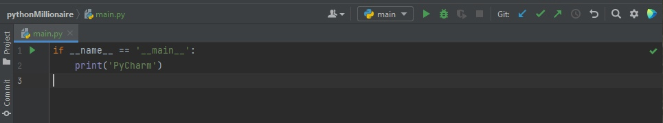

## Commit "Create Window class"
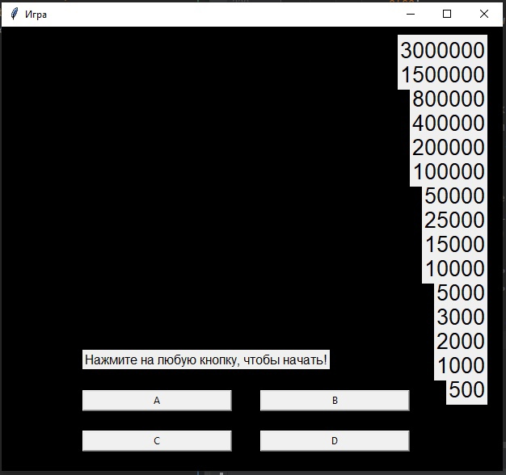
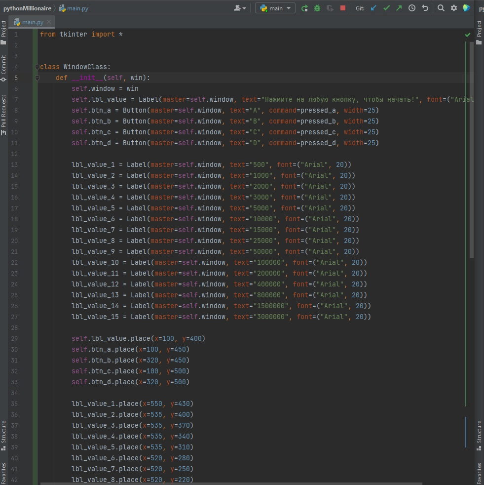
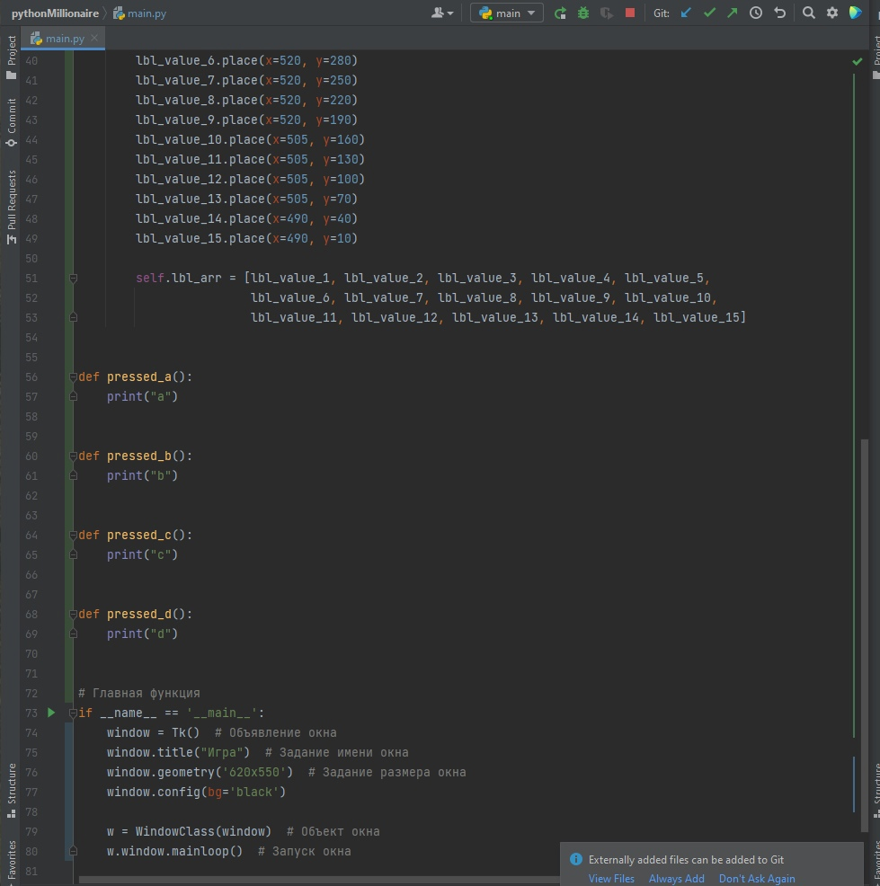

## Commit "Create game logic"
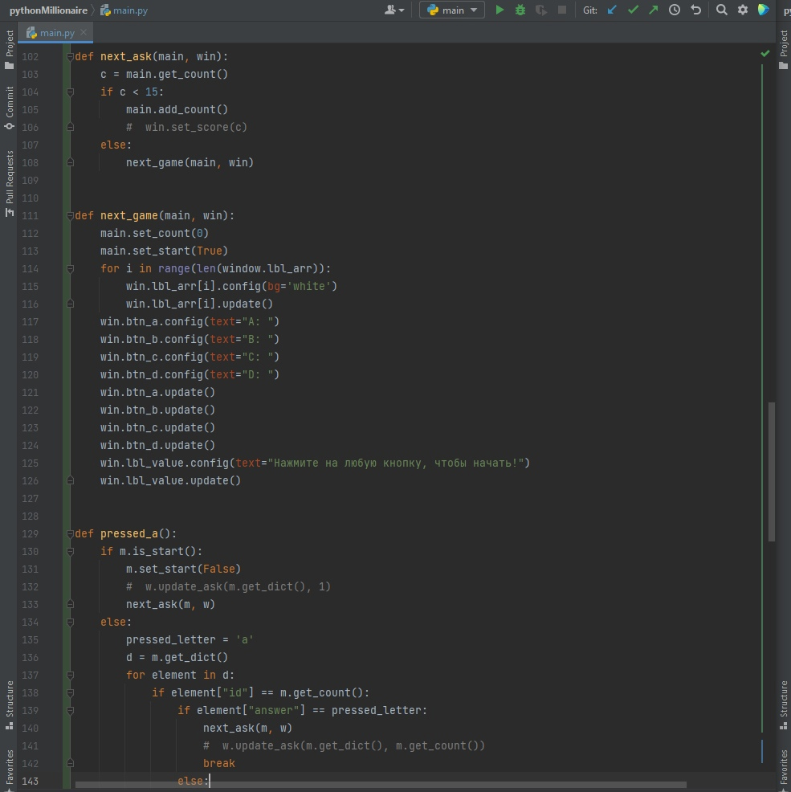
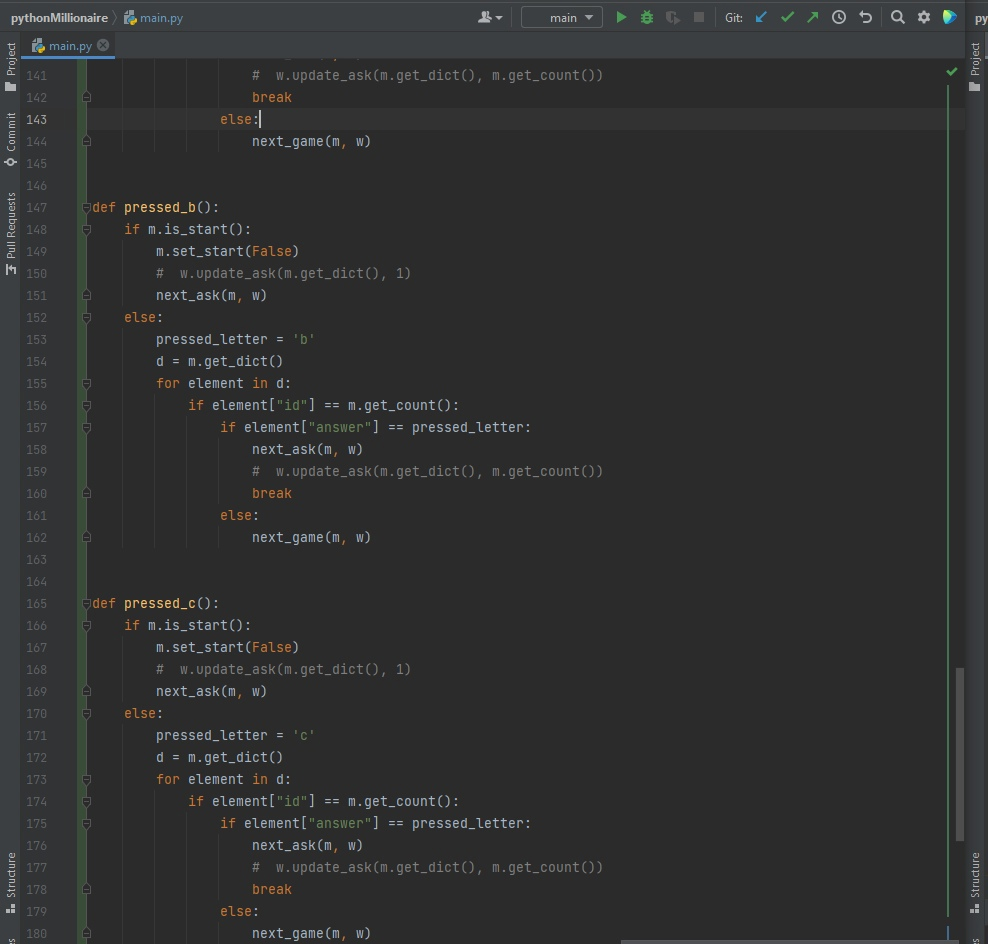
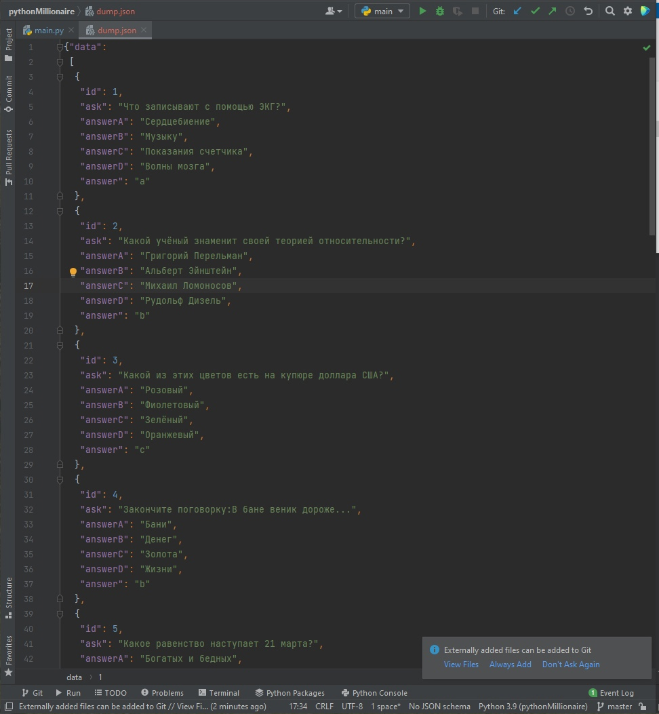

## Commit "Update Window class"
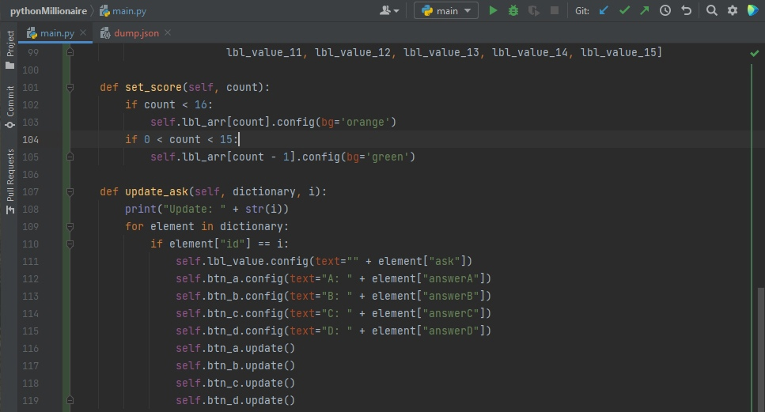

## Commit "Complete game logic"

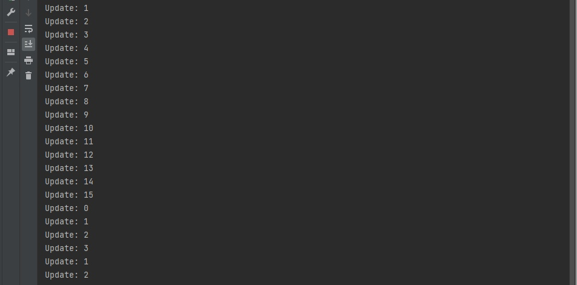
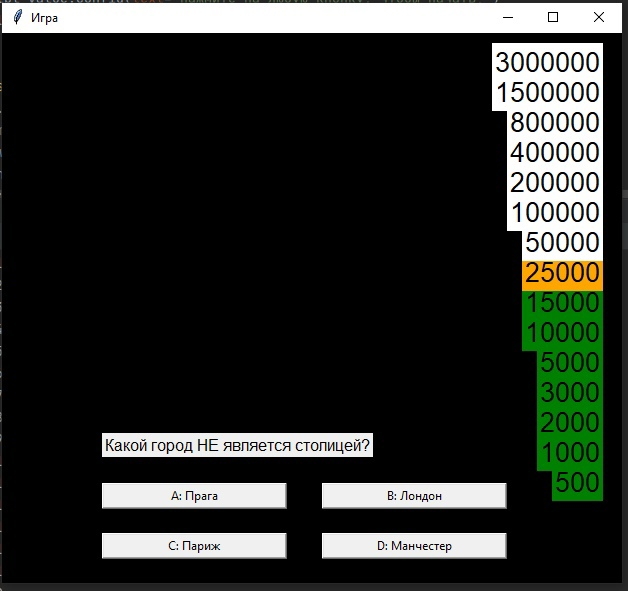

## Commit "Add background"
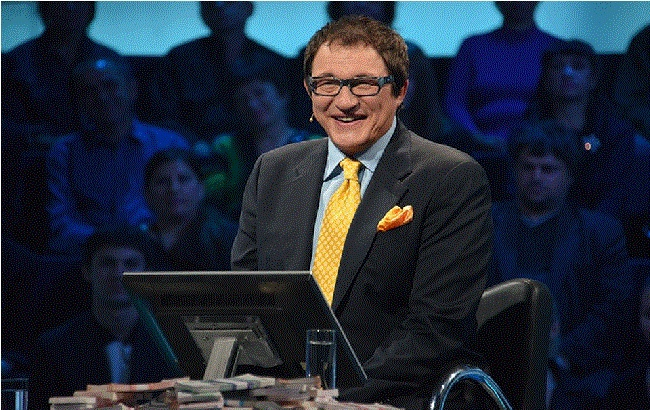
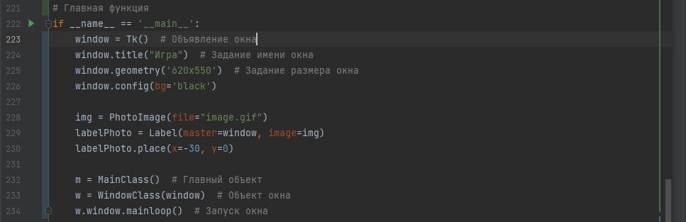
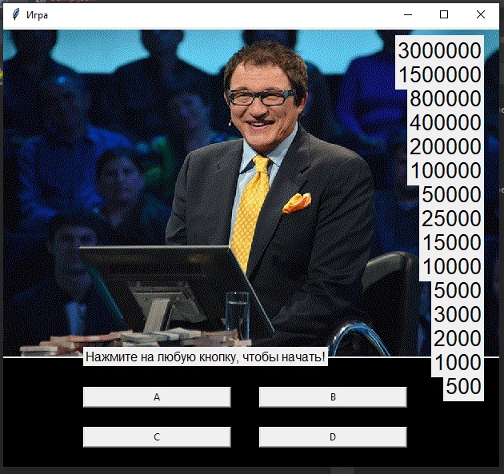
