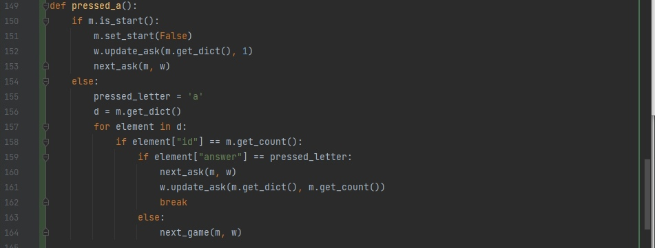

# Практическая работа 3

## Commit "Create game project"

## Commit "Create Window class"

## Commit "Create game logic"

## Commit "Update Window class"

## Commit "Complete game logic"

## Commit "Add background"

